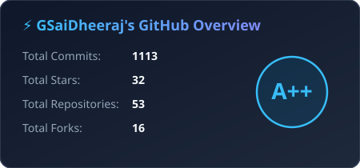
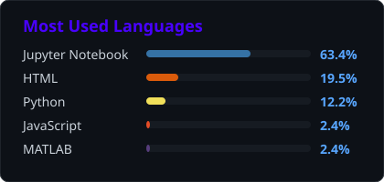

# gsaidheeraj
### Hi there, This is G Sai Dheeraj  
 
<em> 
</em>
 

- 🔭 I’m a Machine Learning Engineer at Motorola Solutions.
- 🌱 With 4+ years of experience and Master's Degree in Data Science.
- 👯 I’m looking to collaborate on Data Science/Machine Learning/LLM stuffs.
- 💬 Ask me about Data Science, Finance, Business, GeoPOlitics, Software Development.
- 📫 How to reach me: <a href= "https://www.linkedin.com/in/gummadi-saidheeraj/">LinkedIn</a>, <a href= "dheerajsaigummadi@gmail.com">Gmail</a>
- ⚡The space in which we live should be for the person we are becoming now, not fot the person we were in the past ⚡
  

<!--START_SECTION:stats-->

  
  

<!--END_SECTION:stats-->

- Portfolio : https://gsaidheeraj.github.io/saidheeraj.ai/
- Linkedin : https://www.linkedin.com/in/gummadi-saidheeraj/
- Blogger : https://studentprojectshub.blogspot.com/
- Email : dheerajsaigummadi@gmail.com
